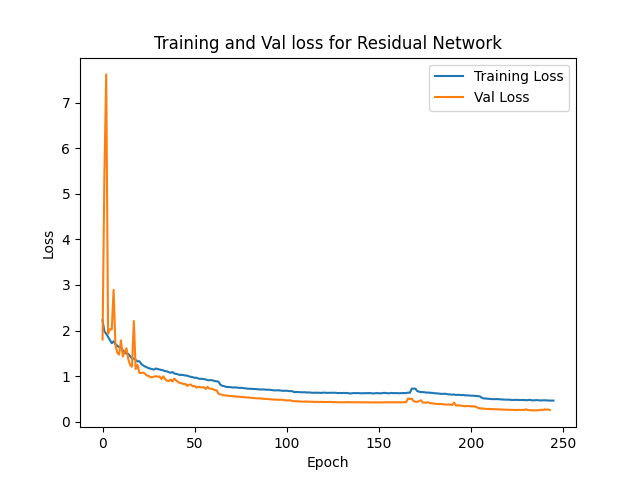
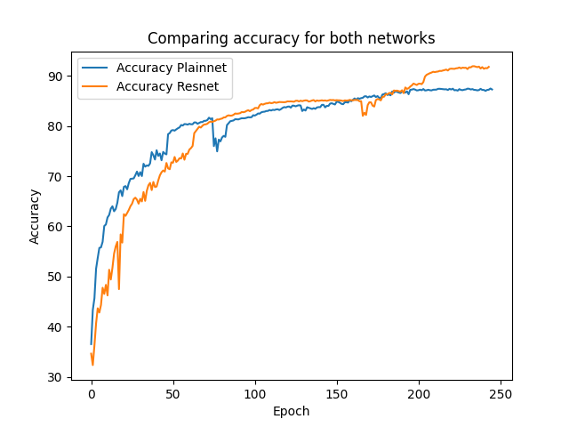

# Resnet Reproduction
Reproduction of the 'Deep Residual Learning for Image Recognition' by Kaiming et Al. 2015 for educational purposes.

[Paper](https://arxiv.org/pdf/1512.03385)

------------
<h3>Overview</h3>

Trained on the [CIFAR10](https://www.cs.toronto.edu/~kriz/cifar.html) dataset. Data augmentation was standard as described in the paper however I added a random rotation as well. I implemented the 34-layer version of the ResNet as desciribed in the paper.

Trained with SGD with LR = 0.01 decreasing at certain time periods. I ran the training more than once so it was at the end trained for a total of >200 epochs. Plainnet plateud at around 87% accuracy (could be a bit more with better hyperparameter tuning or longer training) and Residual network reached around 92% accuracy, close to the 93.57% in the paper. I believe better hyperparameter tuning, and a longer training period could reach close to that value. 

---------------

<h3>Results: </h3>

Validation and Training loss (I believe the training is loss is higher than the validation due to the misplacement of the validation function: noticed after training the network)

Accuracy comparison with plain network (no skip connections)
